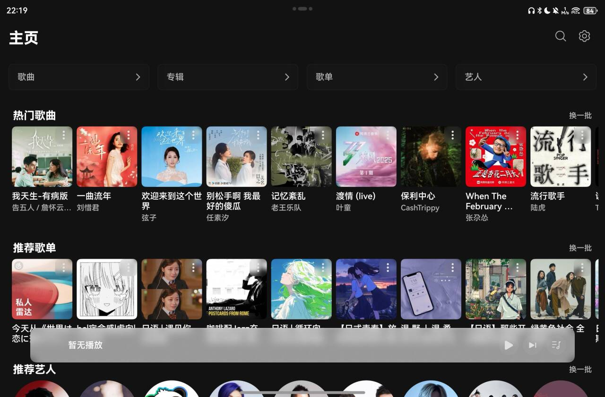
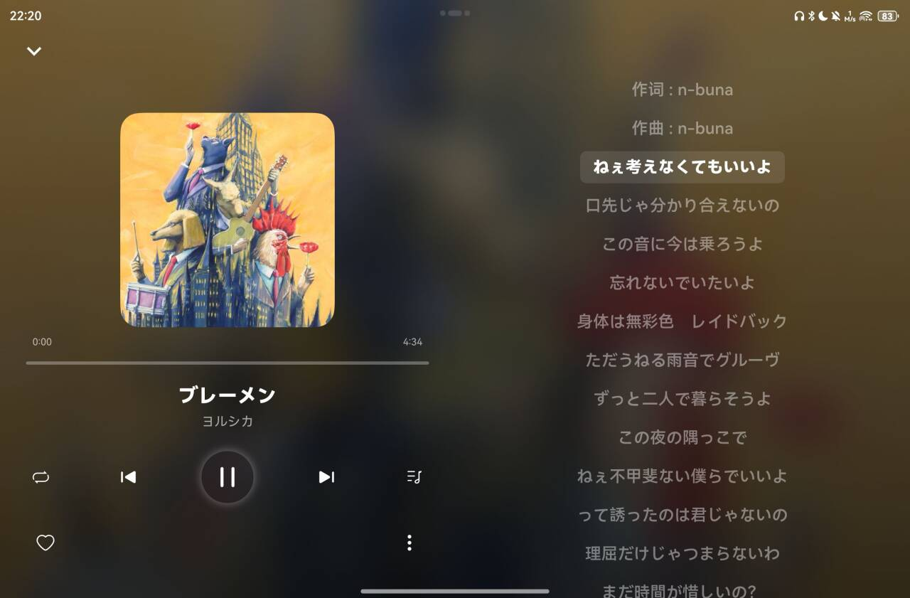

# 🎉 全新云享社2.0震撼发布！🚀

> 📌 **官方网站**: [music.yby.zone](https://music.yby.zone)  
> 📢 **反馈意见**: [music.yby.zone/feedback.html](https://music.yby.zone/feedback.html)

## 📱 预览

    
    

## ✨ 简介
这是一个基于鸿蒙HarmonyOS Next API 15版本**全新重构**开发的网络音乐播放器统一UI容器。2.0版本带来了惊艳的UI设计和革命性的数据源架构，支持连接多个平台和私有数据源。我们致力于提供流畅的原生体验，同时保留并增强您喜爱的所有功能！

> ⚠️ **注意**: 数据源基本格式定义文档正在撰写中。当前信息可能不完整或有变更。我们将尽快完成并更新此文档。

## 🔥 全新特性 (2.0)
- **🎨 炫酷UI设计**
    - 采用最新的Navigation导航设计
    - 符合HarmonyOS设计规范的现代界面
    - 全新的播放控制界面和动效

- **🌐 多平台数据源支持**
    - 支持连接多个音乐平台
    - 支持私有数据源接入
    - 统一的UI容器，一致的使用体验

- **🔐 灵活的认证方式**
    - 令牌登录
    - 扫码登录（需数据源平台支持）

## 🎵 基础功能
- **💯 核心音乐功能**
    - 歌曲和歌单搜索
    - 访问已创建和收藏的歌单
    - 在线音乐流播放

- **⭐ 额外功能**
    - 深色模式支持
    - 平板/手机自适应布局

## 🛠️ 技术细节
- 平台：HarmonyOS Next
- API版本：15 (全新重构版本)
- 架构：模块化数据源设计

## 🤝 参与贡献
我们欢迎社区成员参与项目建设！您可以通过以下方式贡献：
- 📝 报告问题
- 💡 提出新功能建议
- 👨‍💻 贡献代码
- 📚 改进文档
- 🔌 添加新的数据源支持

欢迎提交 Issue 和 Pull Request，让我们一起把这个客户端做得更好！

## 📜 开源协议
GNU通用公共许可证第二版 (GPLv2)

我们选择GPLv2许可证是因为我们坚信软件自由和开源精神。使用此许可证确保任何对本项目的修改和衍生作品也将保持开源，从而促进知识共享和社区协作。我们鼓励大家在此基础上进行创新，共同推动开源社区的发展。

版权所有 (C) [2025] Okysu

本程序是自由软件；您可以根据自由软件基金会发布的GNU通用公共许可证第二版的条款重新分发和/或修改它；要么使用许可证的第二版，要么（由您选择）使用任何更新的版本。

发布本程序的目的是希望它有用，但没有任何担保；甚至没有对适销性或特定用途适用性的暗示担保。有关更多详细信息，请参阅GNU通用公共许可证。

您应该已经随本程序收到一份GNU通用公共许可证副本；如果没有，请参阅<http://www.gnu.org/licenses/>。